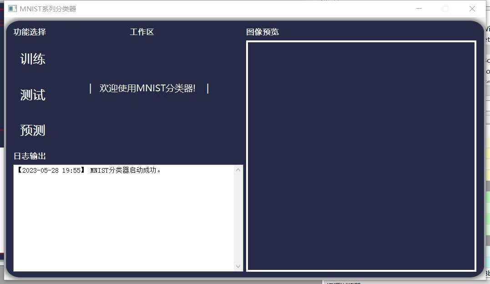
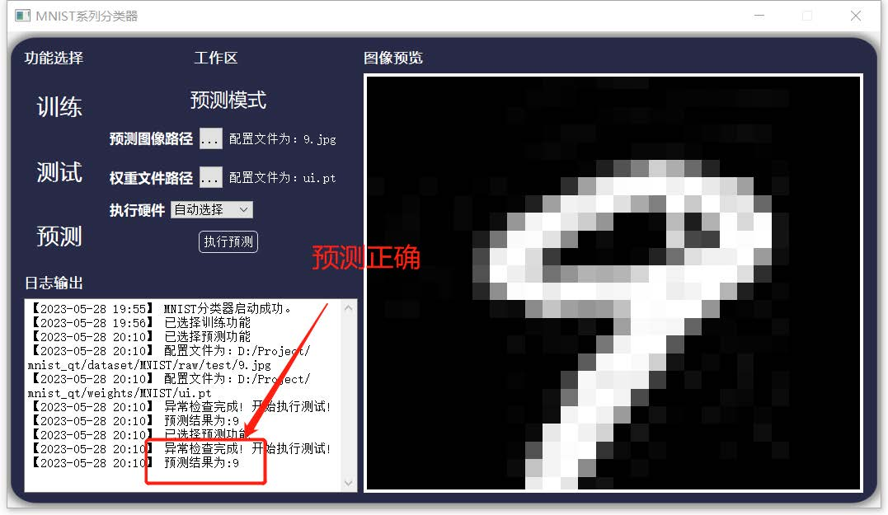

# 介绍

本项目为北方工业大学软件工程课程课程作业，由李欣老师指导完成。

本软件项目使用图形化界面实现了MNIST和FashionMNIST数据集的训练、测试、预测。GUI部分使用PYQT5实现，深度学习相关部分使用pytorch实现。

实验报告链接：[doc/实验报告.pdf](doc/实验报告.pdf)

# 运行

首次运行需要运行`script/get_mnist.py`下载MNSIT和FashionMNIST数据集

```shell
python get_mnist.py
```

配置好环境并下载好数据集后，运行`main_ui.py`即可

```shell
python main_ui.py
```


# 效果展示

<center>
    
    <br>
    <div style="color:orange; border-bottom: 1px solid #d9d9d9;
    display: inline-block;
    color: #999;
    padding: 1px;"></div>
</center>

<center>
    
    <br>
    <div style="color:orange; border-bottom: 1px solid #d9d9d9;
    display: inline-block;
    color: #999;
    padding: 1px;"></div>
</center>